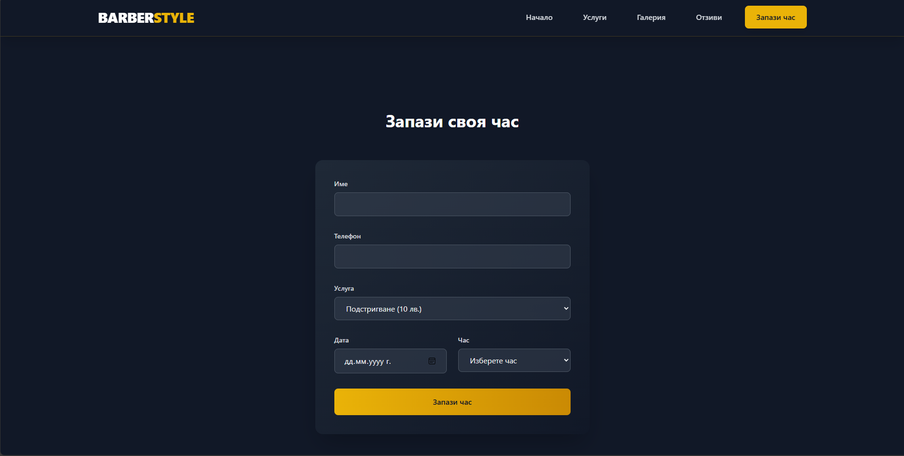

# 💈 Barbershop Booking System

A modern and fully functional Barbershop Booking System built with HTML, CSS, JavaScript, and a powerful backend with an Admin Panel. This project allows customers to book appointments online while providing barbers with an easy way to manage their schedules.

---

### ✨ Features:
- ✅ **User-Friendly Booking System**  
   Clients can select available time slots and book appointments.
   - *Screenshot: Show the booking interface with available time slots and a user selecting a time.*

- ✅ **Admin Panel**  
   Manage bookings, barbers, and schedules with an intuitive dashboard.
   - *Screenshot: Show the admin panel with bookings listed and controls for adding/removing barbers.*

- ✅ **Responsive Design**  
   Fully optimized for desktop and mobile devices.
   - *Screenshot: Show the system in use on both desktop and mobile views.*

- ✅ **Backend Integration**  
   Secure authentication, database management, and API communication.
   - *Screenshot: Show the login/signup page or an API interaction (optional).*

- ✅ **Modern UI/UX**  
   Styled using Tailwind CSS for a sleek and professional look.
   - *Screenshot: Show a nicely styled section, such as the main booking page or confirmation screen.*

---

### 🛠️ Technologies Used:
- **Frontend**: HTML, CSS (Tailwind), JavaScript
- **Backend**: Node.js, Express.js
- **Admin Dashboard**: Custom-built for managing bookings

---

### 🚀 Setup & Installation:

1. **Clone the repository**:
   ```bash
   git clone <repository_url>
   ```

2. **Install dependencies**:
   ```bash
   npm install
   ```

3. **Start the development server**:
   ```bash
   npm run dev
   ```

---

### 📸 Screenshots:

- **User Booking Interface**  
   

- **Admin Dashboard**  
  *Screenshot of the admin panel with a list of scheduled appointments and controls for editing.*

- **Mobile View**  
  *Screenshot showing the responsive layout on a mobile device.*

